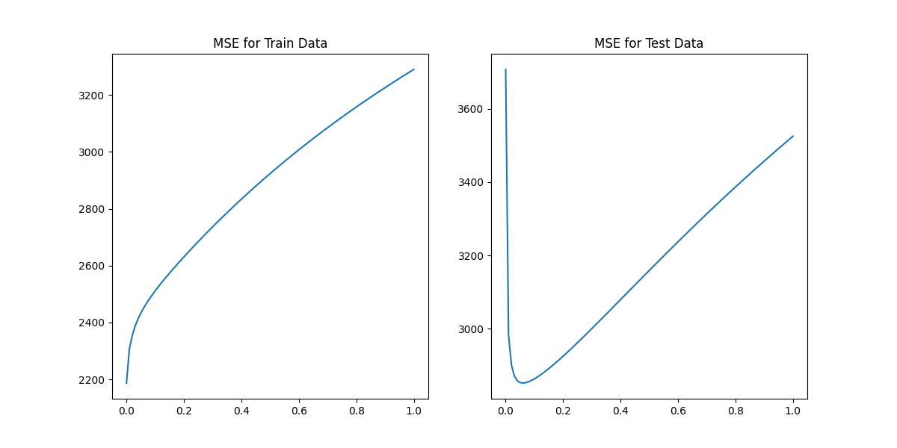
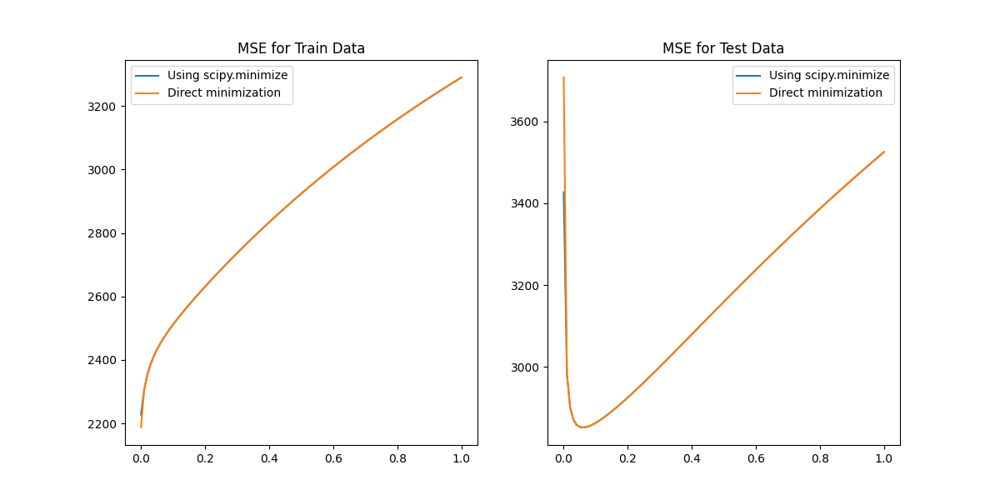
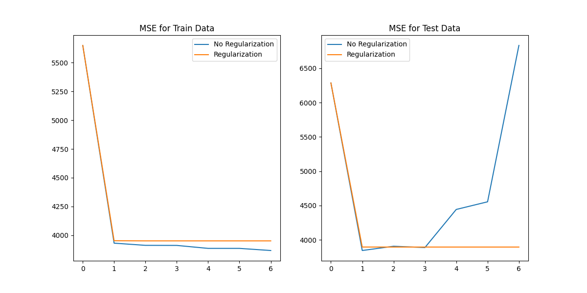

# Machine Learning: Classification and Regression Project

This project demonstrates a complete pipeline of implementing and analyzing **classical machine learning models** from scratch. It covers both **classification (LDA, QDA)** and **regression (OLS, Ridge, Gradient-based Ridge, Polynomial Regression)** tasks, using real and synthetic datasets.  

---

## 📌 Overview

The goal of this project is to:
- Implement key ML algorithms manually without relying on scikit-learn.  
- Compare **generative classifiers** (LDA vs QDA).  
- Analyze the effect of **intercept terms** and **regularization** in regression.  
- Study the bias–variance tradeoff via **Ridge Regression**.  
- Verify equivalence of **closed-form** vs **gradient-based optimization**.  
- Explore **non-linear regression** using polynomial feature mapping.  

All code is in a single `script.py` file, with reusable functions for each problem.

---

## ⚙️ Methods Implemented

### 1. **Linear Discriminant Analysis (LDA)**
- Learns per-class means and a shared covariance matrix.  
- Assumes equal covariance for all classes → linear boundaries.  

### 2. **Quadratic Discriminant Analysis (QDA)**
- Learns per-class means and individual covariance matrices.  
- Allows class-specific covariance → quadratic boundaries.  

### 3. **Ordinary Least Squares Regression (OLS)**
- Implemented with and without intercept.  
- Shows why bias terms drastically improve regression performance.  

### 4. **Ridge Regression (Closed-form)**
- Penalizes large weights to improve generalization.  
- Sweeps λ ∈ [0, 1] and identifies λ\* that minimizes test MSE.  

### 5. **Ridge Regression (Gradient Descent)**
- Uses `scipy.optimize.minimize` with gradient computation.  
- Confirms equivalence to closed-form ridge regression.  

### 6. **Polynomial Regression**
- Maps a single feature to polynomial basis up to degree 6.  
- Compared with/without regularization (λ = λ\* from Ridge).  
- Demonstrates overfitting in unregularized high-degree polynomials.  

---

## 📊 Results Summary

- **Classification**
  - LDA Accuracy: **97%**  
  - QDA Accuracy: **96%**  
  - LDA uses linear boundaries; QDA allows curved boundaries.  

- **Regression**
  - OLS without intercept → MSE ≈ **106,775** (very poor).  
  - OLS with intercept → MSE ≈ **3,708** (huge improvement).  
  - Ridge Regression optimal λ\* = **0.06** (min test MSE).  
  - Gradient Descent Ridge curves overlap closed-form Ridge.  

- **Polynomial Regression**
  - Without regularization: overfits as degree increases.  
  - With λ = 0.06: stable test MSE, best around degree **p = 3**.  

---

## 📈 Figures

Figures generated by the script:

1. **LDA vs QDA Decision Boundaries**  
   Shows difference in classification regions.  
   

2. **Ridge Regression MSE vs λ (Closed-form)**  
   Visualizes bias–variance tradeoff.  
   

3. **Ridge: Closed-form vs Gradient Descent**  
   Demonstrates numerical equivalence.  
   

4. **Polynomial Regression with/without Regularization**  
   Shows effect of λ on controlling overfitting.  
   

---

## 🛠️ Tech Stack

- **Python 3.10**  
- **NumPy** (linear algebra, array operations)  
- **SciPy** (optimization)  
- **Matplotlib** (plots & figures)  

---

## 🚀 How to Run

```bash
# install dependencies
pip install numpy scipy matplotlib

# run the main script
python script.py
```

## 🎯 Key Takeaways

- Classification: Both LDA and QDA work well; LDA slightly higher accuracy.
- Intercept: Essential in regression for proper model fit.
- Ridge Regularization: λ* ≈ 0.06 balances bias and variance, improving test error.
- Optimization: Gradient descent Ridge matches closed-form solution, proving implementation correctness.
- Polynomial Expansion: Without regularization → overfitting; with λ* → stable generalization.
